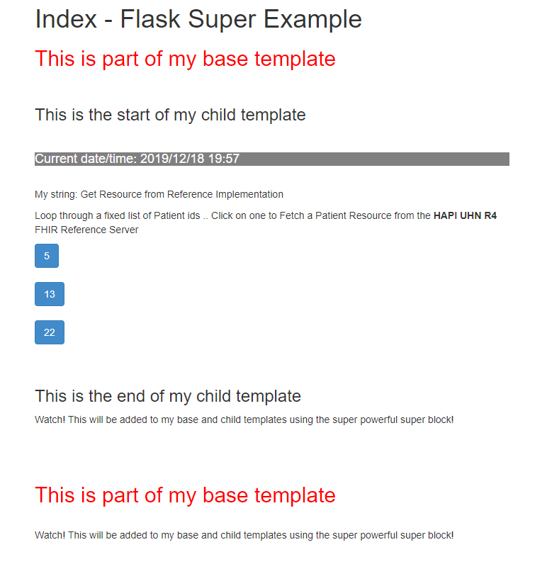
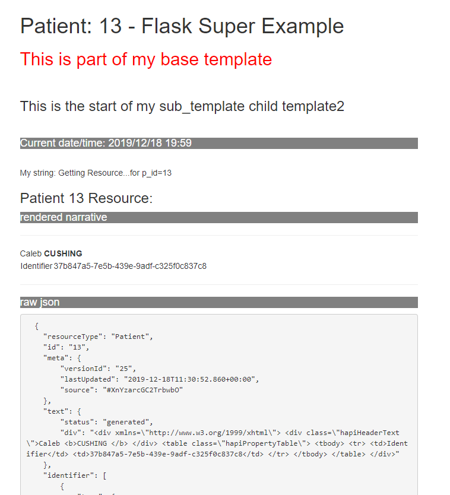

# JInja2_Template
### Example Starter Flask Application as a Reference Implementation Facade.

### This Simple template list some patient ids.

### Selecting and Id causes the app to fetch the resource and display it.

